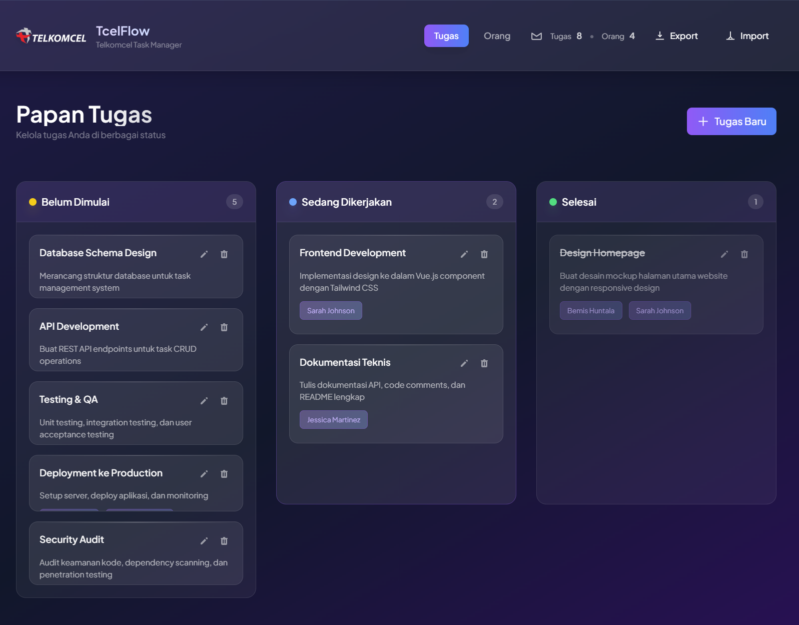

# TcelFlow - Telkomcel Task Manager 

Dashboard manajemen tugas modern dengan desain Premium SaaS, dibangun menggunakan Vue.js 3, Tailwind CSS CDN, dan dual-layer storage (IndexedDB + localStorage) untuk persistensi data yang kokoh.



---

## 📋 Fitur Utama

### ✅ Manajemen Tugas (Task Management)
- **Papan Kanban Interaktif**: Visualisasi tugas dalam 3 kolom status
  - Belum Dimulai (Todo)
  - Sedang Dikerjakan (In Progress)  
  - Selesai (Done)
- **CRUD Lengkap**: Buat, baca, ubah, dan hapus tugas dengan mudah
- **Deskripsi Terperinci**: Tambahkan deskripsi detail untuk setiap tugas
- **Penugasan Orang**: Tugaskan tugas kepada satu atau lebih anggota tim
- **Status Tracking**: Pantau progress tugas secara real-time

**Kode Contoh - Membuat Task Baru**:
```javascript
const saveTask = () => {
    if (!taskForm.title.trim()) return;
    const newTask = {
        id: Date.now().toString(),
        title: taskForm.title,
        description: taskForm.description,
        status: taskForm.status,  // 'Belum Dimulai', 'Sedang Dikerjakan', 'Selesai'
        assignedPics: [...taskForm.assignedPics],
        createdAt: new Date().toISOString()
    };
    tasks.value.push(newTask);
    closeTaskModal();
};
```

### 👥 Manajemen Orang (People Management)
- **Kelola Tim**: Tambah, ubah, dan hapus anggota tim (Person In Contact/PIC)
- **Profil Orang**: Simpan nama dan posisi/peran setiap orang
- **Integrasi Tugas**: Link tugas dengan anggota tim secara langsung
- **Grid Responsif**: Tampilan grid yang menyesuaikan dengan ukuran layar

**Kode Contoh - Menambah Orang**:
```javascript
const savePic = () => {
    if (!picForm.name.trim() || !picForm.role.trim()) return;
    const newPic = {
        id: Date.now().toString(),
        name: picForm.name,
        role: picForm.role,
        createdAt: new Date().toISOString()
    };
    pictures.value.push(newPic);
    closePicModal();
};
```

### 🎨 Desain Premium SaaS
- **Glassmorphism Effect**: Efek kaca modern dengan blur dan transparansi
- **Gradient Background**: Latar belakang mesh gradient yang elegan (Indigo → Slate → Violet)
- **Animasi Halus**: Transisi smooth (fadeInSlideUp, slideInUp, scalePop, fadeIn)
- **Responsive Design**: Mobile-first approach untuk semua perangkat
- **Tema Gelap Modern**: Palet warna gelap yang nyaman di mata
- **Sticky Header & Footer**: Header dan footer tetap terlihat saat scroll untuk navigasi yang lebih baik

#### Sticky Header & Footer Design
Header dan footer menggunakan `sticky` positioning dengan glassmorphic effect:

```html
<!-- Sticky Header (top) -->
<header class="sticky top-0 z-50 glass-effect border-b border-white/10 shadow-xl">
    <!-- Logo, branding, navigation -->
</header>

<!-- Main Content -->
<main class="max-w-7xl mx-auto px-4 py-8 pb-32">
    <!-- Tugas Kanban Board -->
</main>

<!-- Sticky Footer (bottom) -->
<footer class="sticky bottom-0 z-40 glass-effect border-t border-white/10">
    <div class="max-w-7xl mx-auto px-4 sm:px-6 lg:px-8 py-4 sm:py-5">
        <div class="flex flex-col sm:flex-row items-center justify-between gap-4 sm:gap-6">
            <!-- Copyright Section -->
            <div class="text-center sm:text-left">
                <p class="text-xs sm:text-sm text-white/70 font-medium">
                    © 2025 <a href="https://github.com/bmzashura" target="_blank" 
                       class="text-violet-400 hover:text-violet-300 transition-colors font-semibold">
                       bmzashura</a>. All rights reserved.
                </p>
            </div>

            <!-- Developer Section -->
            <div class="text-center sm:text-right">
                <p class="text-xs sm:text-sm text-white/70 font-medium">
                    Dikembangkan oleh <span class="text-white font-semibold">Bemis Huntala</span>
                </p>
            </div>
        </div>
    </div>
</footer>
```

**Keunggulan Sticky Layout**:
- Header selalu accessible untuk navigation/counters/export
- Footer selalu visible untuk branding dan developer info
- `z-50` (header) dan `z-40` (footer) mencegah overlap dengan konten modal
- `pb-32` pada main content memastikan footer tidak menutupi konten akhir
- Responsive: Text size dan layout berubah pada mobile (sm breakpoint)

### 💾 Persistensi Data - Dual-Layer Storage

#### IndexedDB Integration
- **Kapasitas Besar**: 50MB+ per domain (vs 5-10MB localStorage)
- **Asinkron**: Non-blocking operations untuk performa optimal
- **Struktural**: Mendukung objek kompleks tanpa serialisasi

**Kode Helper IndexedDB**:
```javascript
const openIDB = () => {
    return new Promise((resolve, reject) => {
        if (!window.indexedDB) return reject(new Error('IndexedDB tidak tersedia'));
        const req = indexedDB.open('tcelflow-db', 1);
        req.onupgradeneeded = (e) => {
            const db = e.target.result;
            if (!db.objectStoreNames.contains('kv')) {
                db.createObjectStore('kv');
            }
        };
        req.onsuccess = () => resolve(req.result);
        req.onerror = () => reject(req.error);
    });
};

const idbSet = async (key, value) => {
    const db = await openIDB();
    return new Promise((resolve, reject) => {
        const tx = db.transaction('kv', 'readwrite');
        const store = tx.objectStore('kv');
        const req = store.put(value, key);
        req.onsuccess = () => {
            resolve(true);
            db.close();
        };
        req.onerror = () => {
            reject(req.error);
            db.close();
        };
    });
};

const idbGet = async (key) => {
    const db = await openIDB();
    return new Promise((resolve) => {
        const tx = db.transaction('kv', 'readonly');
        const store = tx.objectStore('kv');
        const req = store.get(key);
        req.onsuccess = () => {
            resolve(req.result);
            db.close();
        };
    });
};
```

#### Dual-Save Strategy
```javascript
const saveToStorage = async () => {
    try {
        // 1. Simpan ke localStorage (immediate available)
        localStorage.setItem('pics', JSON.stringify(pictures.value));
        localStorage.setItem('tasks', JSON.stringify(tasks.value));

        // 2. Simpan ke IndexedDB (fallback jika localStorage penuh)
        await idbSet('pics', pictures.value).catch(e => console.warn('idb save gagal', e));
        await idbSet('tasks', tasks.value).catch(e => console.warn('idb save gagal', e));
    } catch (e) {
        console.error('Gagal menyimpan data ke storage:', e);
    }
};

// Auto-save pada setiap perubahan
watchEffect(() => {
    saveToStorage();
});
```

#### Load dengan Fallback
```javascript
const loadFromStorage = async () => {
    // Coba IndexedDB dulu
    const idbPics = await idbGet('pics').catch(() => null);
    const idbTasks = await idbGet('tasks').catch(() => null);

    if (idbPics && Array.isArray(idbPics)) {
        pictures.value = idbPics;
    } else {
        // Fallback ke localStorage
        const storedPics = localStorage.getItem('pics');
        if (storedPics) {
            try {
                pictures.value = JSON.parse(storedPics);
            } catch (e) {
                console.error('Gagal memuat data PIC:', e);
            }
        }
    }

    if (idbTasks && Array.isArray(idbTasks)) {
        tasks.value = idbTasks;
    } else {
        const storedTasks = localStorage.getItem('tasks');
        if (storedTasks) {
            try {
                tasks.value = JSON.parse(storedTasks);
            } catch (e) {
                console.error('Gagal memuat data Task:', e);
            }
        }
    }
};
```

### 📊 Storage Monitoring & Export

#### Live Storage Counters
Tampilkan jumlah item di header secara real-time:

```javascript
// Computed counts untuk UI
const tasksCount = computed(() => tasks.value.length);
const picsCount = computed(() => pictures.value.length);
```

Di template:
```html
<div class="flex items-baseline gap-2">
    <span class="text-xs text-white/60">Tugas</span>
    <span class="font-semibold">{{ tasksCount }}</span>
</div>
<span class="text-white/30">•</span>
<div class="flex items-baseline gap-2">
    <span class="text-xs text-white/60">Orang</span>
    <span class="font-semibold">{{ picsCount }}</span>
</div>
```

#### Export Data ke JSON
Tombol Export mengunduh semua data dengan timestamp:

```javascript
const exportData = () => {
    try {
        const payload = {
            exportedAt: new Date().toISOString(),
            tasks: tasks.value,
            pics: pictures.value
        };
        const blob = new Blob([JSON.stringify(payload, null, 2)], { type: 'application/json' });
        const url = URL.createObjectURL(blob);
        const a = document.createElement('a');
        a.href = url;
        a.download = `tcelflow-export-${new Date().toISOString()}.json`;
        document.body.appendChild(a);
        a.click();
        a.remove();
        URL.revokeObjectURL(url);
        console.log('✅ Data berhasil diekspor');
    } catch (e) {
        console.error('Gagal mengekspor data:', e);
    }
};
```

#### Import Data dari JSON
Tombol Import memungkinkan restore data dari file JSON yang di-export sebelumnya:

**Cara Menggunakan Import**:
1. Klik tombol **"Import"** di header (sebelah Export button)
2. Dialog file picker akan terbuka
3. Pilih file JSON yang ingin di-import (contoh: `sample-data.json`)
4. Akan muncul dialog konfirmasi dengan info jumlah data
5. Klik OK untuk restore atau Cancel untuk batal
6. Data otomatis tersimpan ke IndexedDB + localStorage

```javascript
const importData = async (file) => {
    try {
        const text = await file.text();
        const data = JSON.parse(text);

        // Validasi struktur JSON
        if (!data.tasks || !Array.isArray(data.tasks)) {
            throw new Error('Format JSON invalid: tidak ada array "tasks"');
        }
        if (!data.pics || !Array.isArray(data.pics)) {
            throw new Error('Format JSON invalid: tidak ada array "pics"');
        }

        // Confirm sebelum overwrite
        const confirm = window.confirm(
            `Import data dari ${new Date(data.exportedAt).toLocaleString()}?\n` +
            `Tugas: ${data.tasks.length}, Orang: ${data.pics.length}\n` +
            `(Data lama akan ditimpa)`
        );

        if (!confirm) return;

        // Restore data
        tasks.value = data.tasks;
        pictures.value = data.pics;

        // Simpan ke storage
        await saveToStorage();

        console.log('✅ Data berhasil diimport');
        alert('Data berhasil diimport!');
    } catch (e) {
        console.error('Gagal mengimport data:', e);
        alert('Gagal mengimport data: ' + e.message);
    }
};

// Handle file import dari input file
const handleFileImport = (event) => {
    const file = event.target.files[0];
    if (file) {
        importData(file);
        // Reset input untuk allow import file yang sama lagi
        event.target.value = '';
    }
};

// Ref untuk file input element
const importFileInput = ref(null);
```

**Export/Import Workflow**:
1. **Export**: Klik tombol "Export" di header → file JSON dengan timestamp otomatis terdownload
2. **Backup**: Simpan file JSON di lokasi aman (cloud, external drive, email)
3. **Import**: Klik tombol "Import" di header → pilih file JSON → konfirmasi → data di-restore

**Use Cases**:
- Backup sebelum eksperimen dengan data besar
- Migrasi data antar device/browser
- Sharing project dengan tim member
- Restore data jika terjadi data loss

Template:
```html
<!-- Export Button -->
<button @click="exportData()" class="px-3 py-2 bg-white/8 text-white rounded-lg">
    <svg xmlns="http://www.w3.org/2000/svg" class="w-4 h-4" viewBox="0 0 24 24" fill="none" stroke="currentColor">
        <path stroke-linecap="round" stroke-linejoin="round" stroke-width="2" d="M12 3v12m0 0l-4-4m4 4l4-4M21 21H3"/>
    </svg>
    <span>Export</span>
</button>

<!-- Import File Input (hidden) -->
<input
    ref="importFileInput"
    type="file"
    id="importFile"
    accept=".json"
    style="display: none;"
    @change="handleFileImport"
/>

<!-- Import Button (triggers hidden file input) -->
<button 
    @click="importFileInput.click()" 
    class="px-3 py-2 bg-white/8 text-white rounded-lg"
>
    <svg xmlns="http://www.w3.org/2000/svg" class="w-4 h-4" viewBox="0 0 24 24" fill="none" stroke="currentColor">
        <path stroke-linecap="round" stroke-linejoin="round" stroke-width="2" d="M12 3v12m0 0l4 4m-4-4l-4 4M3 21h18"/>
    </svg>
    <span>Import</span>
</button>
```

#### Debug Console Logging
Saat aplikasi mulai, otomatis log isi storage ke DevTools Console:

```javascript
const debugStorage = async () => {
    console.group('%cTcelFlow Storage Debug', 'color: #7c3aed; font-weight: bold');
    
    // Log localStorage
    try {
        const lsTasks = JSON.parse(localStorage.getItem('tasks') || '[]');
        const lsPics = JSON.parse(localStorage.getItem('pics') || '[]');
        console.log('localStorage tasks:', lsTasks);
        console.log('localStorage pics:', lsPics);
    } catch (e) {
        console.warn('Gagal membaca localStorage:', e);
    }

    // Log IndexedDB
    try {
        const db = await openIDB();
        const tx = db.transaction('kv', 'readonly');
        const store = tx.objectStore('kv');
        const idbTasks = await new Promise((res) => {
            const r = store.get('tasks');
            r.onsuccess = () => res(r.result);
        });
        const idbPics = await new Promise((res) => {
            const r = store.get('pics');
            r.onsuccess = () => res(r.result);
        });
        console.log('IndexedDB tasks:', idbTasks);
        console.log('IndexedDB pics:', idbPics);
        db.close();
    } catch (e) {
        console.warn('Gagal membaca IndexedDB:', e);
    }

    console.groupEnd();
};

// Jalankan saat load
await loadFromStorage();
debugStorage();
```

---

## 🛠️ Teknologi yang Digunakan

### Frontend Framework
- **Vue.js 3** (CDN)
  - Composition API untuk state management yang modular
  - Reactive data binding dan computed properties
  - Watch/WatchEffect untuk side effects

### Styling
- **Tailwind CSS** (CDN)
  - Utility-first CSS framework
  - Mobile-first responsive design
  - Custom glassmorphism effects

### Penyimpanan Data
- **IndexedDB** - Asinkron, kapasitas besar (50MB+)
- **localStorage** - Fallback, synchronous
- **Dual-layer redundancy** untuk reliabilitas maksimal

### Server & Deployment
- **Node.js 12+** - HTTP server sederhana
- **No build tools** - Berjalan langsung di browser
- **Pure ES6+ JavaScript** - Tanpa transpiler

---

## 📦 Instalasi & Penggunaan

### Prasyarat
```
- Node.js 12+ (untuk menjalankan server)
- Browser modern (Chrome 90+, Firefox 88+, Safari 14+)
- Support untuk ES6+, IndexedDB, localStorage, CSS Grid/Flexbox
```

### Setup

1. **Ekstrak folder proyek**:
```bash
cd UTS-stateless-app
```

2. **Jalankan server**:
```bash
npm start
```
Server akan berjalan di `http://localhost:8000`

3. **Akses aplikasi**:
Buka browser ke `http://localhost:8000`

### Testing dengan Sample Data

File `sample-data.json` tersedia untuk testing fitur import:

1. Buka aplikasi di browser
2. Klik tombol **"Import"** di header
3. Pilih file `sample-data.json`
4. Konfirmasi import (akan menampilkan: 8 Tugas, 4 Orang)
5. Klik OK untuk restore data sample
6. Lihat data tampil di Papan Tugas dan Tab Orang

**Struktur Sample Data**:
- **8 Tasks**: Berbagai status (Selesai: 1, Sedang Dikerjakan: 2, Belum Dimulai: 5)
- **4 PICs**: Project Manager, UI Designer, Backend Dev, QA Engineer
- **Assignments**: Beberapa task sudah assign ke multiple people

Gunakan ini untuk:
- Test fitur import/export
- Demo aplikasi dengan data lengkap
- Understand struktur JSON format
- Test Kanban board dengan banyak data

---

## 📁 Struktur Proyek

```
UTS-stateless-app/
├── index.html          # Vue.js template + UI markup
├── app.js             # Composition API logic
├── styles.css         # Glassmorphism + animations
├── server.js          # Node.js HTTP server
├── package.json       # npm metadata
├── README.md          # Dokumentasi lengkap
├── sample-data.json   # Data sample untuk testing import
└── images/
    └── white-logo.png # Telkomsel logo
```

### File Details

**index.html** (580 lines)
- Vue.js 3 template dengan v-directives
- **Sticky Header** (top-0, z-50): Logo (h-28 w-28), branding "Telkomcel Task Manager", tab navigation, storage counters, Export button
- **Sticky Footer** (bottom-0, z-40): Copyright info, developer attribution, glassmorphic design dengan proper padding
- Kanban board dengan 3 kolom status (Belum Dimulai, Sedang Dikerjakan, Selesai) + task cards
- Modal forms untuk create/edit tasks dan PICs dengan smooth animations
- Storage counters (desktop-only responsive) dan tombol Export dengan SVG icon
- Layout dengan `pb-32` pada main element untuk prevent footer overlap saat scroll

**app.js** (500+ lines)
- `setup()` function dengan Composition API
- State: `pictures`, `tasks`, `currentTab`, form objects
- IndexedDB + localStorage dual-save logic
- CRUD methods: `saveTask`, `deletePic`, `savePic`, dll
- Computed filters: `getTodos`, `getInProgress`, `getDone`
- Storage helpers: `openIDB`, `idbSet`, `idbGet`, `loadFromStorage`
- Debug logger: automatic console output saat app start

**styles.css** (400+ lines)
- Global mesh gradient background
- Glassmorphism effect classes: `.glass-effect`, `.glass-effect-light`
- Kanban board layout dengan CSS Grid
- Smooth animations: `fadeInSlideUp`, `slideInUp`, `scalePop`
- Custom scrollbar styling
- Responsive breakpoints dengan Tailwind

**server.js** (100+ lines)
- HTTP server dengan `http` module
- MIME type detection untuk file serving
- 404/500 error handling
- SPA fallback ke `index.html`
- Graceful shutdown pada SIGTERM

---

## 🎯 Panduan Penggunaan Lengkap

### Layout Navigation Tips
Aplikasi menggunakan sticky header dan footer untuk kemudahan navigasi:
- **Header (Top)**: Selalu accessible - klik tab "Tugas"/"Orang", lihat storage counters, export data
- **Footer (Bottom)**: Selalu visible - informasi developer dan copyright
- **Main Content**: Scrollable di tengah dengan padding bottom untuk prevent footer overlap
- **Z-Index**: Header (z-50) > Footer (z-40) > Modals (z-40) untuk prevent overlap

### Membuat Tugas Baru
1. Klik **"Tugas Baru"** (header kanan)
2. Isi form:
   - **Judul** (required)
   - **Deskripsi** (optional)
   - **Status** pilih: Belum Dimulai / Sedang Dikerjakan / Selesai
   - **Tugaskan kepada** (optional, multi-select)
3. Klik **"Buat"**
4. Data langsung tersimpan ke IndexedDB + localStorage

### Mengubah Tugas
1. Di Papan Tugas, klik ikon ✏️ pada task card
2. Ubah field yang diinginkan
3. Klik **"Ubah"**

### Menghapus Tugas
1. Klik ikon 🗑️ pada task card
2. Konfirmasi di dialog
3. Task terhapus dari storage

### Mengelola Orang (PIC)
- **Tambah**: Tab "Orang" → "Tambah Orang" → form → "Tambah"
- **Ubah**: Klik ✏️ pada card → ubah → "Ubah"
- **Hapus**: Klik 🗑️ → konfirmasi (task tetap ada)

### Monitoring & Backup
- **Storage Status**: Lihat counter tugas/orang di header (desktop)
- **Export**: Klik tombol "Export" di header → download JSON dengan timestamp
- **Import**: Klik tombol "Import" di header → pilih file JSON untuk restore data
- **Debug**: Buka DevTools → Console → Cari group "TcelFlow Storage Debug"

---

## 💾 Detail Penyimpanan Data

### Format JSON yang Disimpan

**localStorage key: 'tasks'**
```json
[
  {
    "id": "1701414060000",
    "title": "Design Homepage",
    "description": "Create mockup",
    "status": "Sedang Dikerjakan",
    "assignedPics": ["1701414000000"],
    "createdAt": "2025-12-01T10:01:00.000Z"
  }
]
```

**localStorage key: 'pics'**
```json
[
  {
    "id": "1701414000000",
    "name": "John Doe",
    "role": "Project Manager",
    "createdAt": "2025-12-01T10:00:00.000Z"
  }
]
```

**IndexedDB 'tcelflow-db' → store 'kv'**
```
key: 'tasks' → value: [array of task objects]
key: 'pics'  → value: [array of pic objects]
```

### Verifikasi Storage via Console

**localStorage**:
```javascript
console.log(JSON.parse(localStorage.getItem('tasks')));
console.log(JSON.parse(localStorage.getItem('pics')));
```

**IndexedDB** (Async):
```javascript
(async () => {
  const req = indexedDB.open('tcelflow-db', 1);
  req.onsuccess = (e) => {
    const db = e.target.result;
    const tx = db.transaction('kv', 'readonly');
    const store = tx.objectStore('kv');
    console.log('IDB tasks:', store.get('tasks'));
    console.log('IDB pics:', store.get('pics'));
    db.close();
  };
})();
```

---

## 🔧 Customization

### Mengubah Default Status Tugas

Di **app.js**, ubah array status:
```javascript
// Di dalam saveTask() dan openTaskModal()
taskForm.status = 'Belum Dimulai';  // Default saat create

// Di dalam index.html (form):
v-for="status in ['Belum Dimulai', 'Sedang Dikerjakan', 'Selesai']"
```

### Mengubah Palet Warna

Di **styles.css**:
```css
/* Global gradient background */
body::before {
  background: linear-gradient(135deg, #1e1b4b 0%, #2d1b4e 25%, #2d1f4f 50%, #1e1b4b 75%, #0f1f4f 100%);
}

/* Glassmorphism base color */
.glass-effect {
  background: rgba(255, 255, 255, 0.08);  /* ubah opacity % */
  backdrop-filter: blur(10px);             /* ubah blur px */
}
```

### Menambah Field pada Task/PIC

1. **app.js**: Update `taskForm` / `picForm` object:
   ```javascript
   const taskForm = reactive({
       title: '',
       description: '',
       status: 'Belum Dimulai',
       priority: 'Medium',    // NEW field
       assignedPics: []
   });
   ```

2. **index.html**: Tambah input di modal:
   ```html
   <div>
       <label class="block text-sm font-medium text-white mb-2">Priority</label>
       <select v-model="taskForm.priority" class="w-full px-4 py-2.5 bg-white/10 border border-white/20 rounded-lg text-white">
           <option>Low</option>
           <option>Medium</option>
           <option>High</option>
       </select>
   </div>
   ```

3. **app.js**: Update `saveTask()` untuk include field baru:
   ```javascript
   const newTask = {
       id: Date.now().toString(),
       title: taskForm.title,
       description: taskForm.description,
       status: taskForm.status,
       priority: taskForm.priority,  // SAVE field baru
       assignedPics: [...taskForm.assignedPics],
       createdAt: new Date().toISOString()
   };
   ```

### Customize Sticky Header & Footer

**Mengubah Z-Index Priority** (jika ada overlap):
```html
<!-- Increase header priority -->
<header class="sticky top-0 z-[60] glass-effect ...">

<!-- Decrease footer priority -->
<footer class="sticky bottom-0 z-[30] glass-effect ...">
```

**Mengubah Padding Bottom** (untuk prevent content overlap):
```html
<!-- Di main/section wrapper -->
<main class="max-w-7xl mx-auto px-4 py-8 pb-40">
    <!-- pb-32 = 8rem, pb-40 = 10rem, pb-48 = 12rem -->
    <!-- Sesuaikan dengan tinggi footer -->
</main>
```

**Mengubah Footer Layout** (untuk single column on mobile):
```html
<!-- Current: flex-col sm:flex-row (default) -->
<div class="flex flex-col sm:flex-row items-center justify-between gap-3">

<!-- Alternative: always single column -->
<div class="flex flex-col items-center justify-center gap-3">

<!-- Alternative: always two columns -->
<div class="flex flex-row items-center justify-between gap-3">
```

**Mengubah Header Height**:
```html
<!-- Current: h-24 sm:h-28 -->
<div class="flex items-center justify-between h-24 sm:h-28">
    <!-- h-24 = 6rem (desktop), h-28 = 7rem (mobile) -->
    <!-- Ubah ke h-20 sm:h-24 untuk lebih compact -->
</div>
```

---

## 📊 Vue 3 Composition API Deep Dive

### Setup Function Pattern
```javascript
export default {
    setup() {
        // 1. State (refs for primitives, reactive for objects)
        const tasks = ref([]);
        const taskForm = reactive({ title: '', status: 'Belum Dimulai' });

        // 2. Computed properties (auto-track dependencies)
        const tasksCount = computed(() => tasks.value.length);
        const getTodos = computed(() => 
            tasks.value.filter(t => t.status === 'Belum Dimulai')
        );

        // 3. Methods (functions that modify state)
        const saveTask = () => {
            tasks.value.push(newTask);
        };

        // 4. Watchers (side effects)
        watchEffect(() => {
            saveToStorage();  // Auto-run saat tasks berubah
        });

        // 5. Return exposed state & methods
        return { tasks, taskForm, tasksCount, getTodos, saveTask };
    }
}
```

### Reactive Binding dalam Template
```html
<!-- Two-way binding -->
<input v-model="taskForm.title" />

<!-- Computed display -->
<span>{{ tasksCount }} tasks</span>

<!-- Event handling -->
<button @click="saveTask">Save</button>

<!-- Conditional rendering -->
<div v-if="tasks.length === 0">No tasks</div>

<!-- List rendering dengan key -->
<div v-for="task in getTodos" :key="task.id">{{ task.title }}</div>
```

---

## 🌐 Browser Support & Limitations

✅ **Fully Supported**
- Chrome/Edge 90+
- Firefox 88+
- Safari 14+
- Mobile browsers (iOS Safari, Chrome Mobile)

⚠️ **Requirements**
- ES6+ support (arrow functions, template literals, destructuring)
- CSS Grid & Flexbox
- IndexedDB & localStorage APIs
- CSS backdrop-filter (modern browsers only)

❌ **Not Supported**
- IE 11 (no ES6+, no IndexedDB, no backdrop-filter)
- Browsers dengan private mode (limitation localStorage/IndexedDB)

---

## 🐛 Troubleshooting

### Data Tidak Tersimpan
**Gejala**: Tugas hilang setelah refresh  
**Solusi**:
1. Periksa DevTools → Application → Local Storage → `tasks`/`pics` ada value
2. Periksa DevTools → Application → IndexedDB → `tcelflow-db` → `kv` store
3. Clear cache & localStorage:
   ```javascript
   localStorage.clear();
   // Atau hapus specific keys:
   localStorage.removeItem('tasks');
   localStorage.removeItem('pics');
   ```
4. Buka halaman baru, tambah task, periksa apakah tersimpan

### Modal Tidak Tertutup
**Gejala**: Modal masih terlihat setelah klik "Buat"  
**Solusi**:
1. Klik area luar modal (overlay)
2. Atau klik tombol X di sudut kanan atas
3. Periksa browser console untuk error JavaScript
4. Refresh halaman

### Export Tidak Download
**Gejala**: Klik Export tapi file tidak terdownload  
**Solusi**:
1. Periksa pop-up blocker browser
2. Buka DevTools → Console cek error message
3. Pastikan ada data (tasksCount > 0)
4. Try export lagi, pastikan folder download writable

### IndexedDB Quota Full
**Gejala**: Error "QuotaExceededError" di console  
**Solusi**:
1. Clear old data atau export lalu delete
2. Gunakan DevTools → Application → Storage → Clear site data
3. Data fallback ke localStorage (yang lebih kecil tapi masih available)

### Style/Font Tidak Muncul
**Gejala**: Aplikasi terlihat tanpa styling atau font tidak elegant  
**Solusi**:
1. Refresh halaman (Ctrl+Shift+R pada Chrome)
2. Periksa DevTools → Network apakah CSS CDN loaded
3. Periksa Google Font "Plus Jakarta Sans" loaded: DevTools → Network → "googleapis"
4. Jika offline, styling akan minimal (Tailwind CDN tidak loaded)

---

## 🎓 Real-World Workflow Example

### Project: Website Redesign

**Setup (Day 1)**:
1. Tab "Orang" → Tambah:
   - John (UI Designer)
   - Sarah (Frontend Dev)
   - Mike (Project Manager)

2. Tab "Tugas" → Create backlog:
   - Wireframe desktop
   - Wireframe mobile
   - Design system
   - Frontend implementation
   - Testing
   - Deployment

**Execution (Days 2-10)**:
- Daily standup: Check Papan Tugas
- As designer finishes wireframe → Edit tugas → Status: Sedang Dikerjakan → Assign to Sarah
- Sarah completes component → Status: Selesai
- New task appears automatically in "Selesai" column

**Completion (Day 11)**:
- All tasks moved to "Selesai"
- Click Export → Download JSON backup
- Present to client

---

## 📈 Roadmap Fitur Masa Depan

- [x] Import JSON data (restore from backup) ✅
- [ ] Search & filter tasks
- [ ] Drag-and-drop antar kolom Kanban
- [ ] Due dates & reminders
- [ ] Task priority levels
- [ ] Comments & notes per task
- [ ] Team collaboration (WebSocket)
- [ ] Analytics dashboard
- [ ] Dark/Light theme toggle
- [ ] Recurring tasks template

---

## 👨‍💻 Developer Info

**Dikembangkan oleh**: Bemis Huntala  
**GitHub**: [@bmzashura](https://github.com/bmzashura)  
**Email**: bmz.ashura@gmail.com

## 📄 Lisensi

© 2025 bmzashura. All rights reserved.

Proyek ini dibuat untuk Ujian Tengah Semester. Bebas digunakan dan dimodifikasi untuk keperluan pendidikan dan komersial.

---

**Last Updated**: Desember 2025  
**Version**: 1.3.0 - Import/Export Complete Edition  
**App Name**: TcelFlow - Telkomcel Task Manager  
**Status**: Production Ready ✅

---

## 🔔 Notifikasi & Konfirmasi (Toast + Dialog)

Mulai versi ini, aplikasi menggunakan sistem notifikasi non-blocking (toast) dan dialog konfirmasi kustom untuk pengalaman pengguna yang lebih halus.

- Toast: muncul di pojok kanan-bawah, non-blocking, otomatis menghilang setelah beberapa detik dan dapat ditutup manual.
- Tipe: `success` (hijau, centang) dan `error` (merah, silang).
- Contoh pesan:
    - `Tugas berhasil ditambahkan!`
    - `Tugas berhasil diperbarui!`
    - `Tugas berhasil dihapus!`
    - `Orang berhasil ditambahkan!`
    - `Data berhasil diekspor — file sedang diunduh.`
    - `Data berhasil diimport!`

Dialog konfirmasi kustom menggantikan `window.confirm()` untuk operasi yang merusak (mis. hapus, import). Dialog ini non-blocking — Anda dapat menutupnya atau memilih tindakan. Contoh penggunaan di kode:

```javascript
// Menampilkan dialog konfirmasi yang mengembalikan Promise<boolean>
const ok = await showConfirm('Apakah Anda yakin ingin menghapus task ini?', 'Hapus Tugas');
if (ok) { /* lakukan hapus */ }
```

Pengembang dapat memodifikasi durasi toast atau teks dengan mengubah `notify(message, type, timeout)` di `app.js`.

---

## 📌 Sumber Snippet Code (file & nomor baris)

Untuk mempermudah navigasi, berikut peta lokasi setiap potongan kode (snippet) yang ada di README ke file sumbernya di repository beserta nomor baris yang relevan.

- **Kode Contoh - Membuat Task Baru**: `app.js` lines 366–402
- **Kode Contoh - Menambah Orang**: `app.js` lines 444–476
- **Sticky Header & Footer (HTML example)**: `index.html` header lines 25–140, main snippet lines 121–140, footer lines 630–654
- **Kode Helper IndexedDB (openIDB / idbSet / idbGet)**: `app.js` lines 61–108
- **Dual-Save Strategy (`saveToStorage`)**: `app.js` lines 154–176
- **Load dengan Fallback (`loadFromStorage`)**: `app.js` lines 121–152
- **Computed counts (`tasksCount`, `picsCount`)**: `app.js` lines 188–190
- **Export Data (`exportData`)**: `app.js` lines 232–256
- **Import Data (`importData`)**: `app.js` lines 258–312
- **Export / Import buttons (template)**: `index.html` lines 80–110
- **Debug Storage (`debugStorage`)**: `app.js` lines 497–524
- **Sample data file**: `sample-data.json` lines 1–200 (sample dataset used for Import testing)
- **Global background & glass styles example**: `styles.css` lines 1–40 (`body::before`, mesh gradient)
- **`taskForm` definition (form fields)**: `app.js` lines 42–50

Jika Anda ingin, saya bisa juga menambahkan nomor baris inline di atas setiap block code di README (mis. "Source: app.js lines X–Y") — beri tahu format yang Anda sukai (satu baris caption vs komentar di dalam block). 
